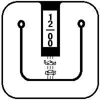

# Race Track — a watchface for Watchy

Two cars race around a circuit to tell the time. The **minute car** advances one
waypoint every 5 minutes, the **hour car** one every hour, and the time is
printed in the box at the centre.



Built for the 200×200 1-bit e-paper display on [Watchy](https://watchy.sqfmi.com/).

---

## Install

1. Set up Watchy with the Arduino IDE following the
   [Getting Started](https://watchy.sqfmi.com/docs/getting-started) guide.
2. Clone this repo **into your Arduino sketchbook**, keeping the folder name:

   ```
   cd <your sketchbook>
   git clone https://github.com/technobot-v1/Race_track.git
   ```

   The folder must stay named `Race_track` — the Arduino IDE requires the
   sketch folder name to match the `.ino` file name.
3. Open `Race_track.ino`, edit `settings.h` (see below), select the board, upload.

### Board settings

Select **Watchy** rather than a generic ESP32 board — it carries the correct
pin map and a roomier partition scheme by default.

> Tools → Board → esp32 → **Watchy**
> Tools → Board Revision → **Watchy v1.5** (or v2.0 — match your hardware)
> Tools → Partition Scheme → leave at the default (Huge APP, 3 MB)

The Board Revision menu defaults to **v1.0**, which is wrong for most watches.
Getting it wrong is not a build error — it shows up as dead buttons or a
nonsense battery reading. If the buttons misbehave, try the other revision.

The build is about 1.14 MB, so it fits any of the partition schemes, including
the 1.25 MB "Default 4MB with spiffs" you get with a generic ESP32 Dev Module.

### Settings

Edit `settings.h` before flashing. This face doesn't draw weather, but Watchy
uses the weather response to correct the clock's UTC offset, so a city that
isn't yours can drift the time by an hour:

- `CITY_ID` — your city from [openweathermap.org](https://openweathermap.org/current#cityid)
- `GMT_OFFSET_SEC` / `DST_OFFSET_SEC` — your timezone

### Versions this was built against

| | |
|---|---|
| Hardware | Watchy v1.5 (ESP32-PICO-D4). v3.0 is a different chip and is untested |
| ESP32 Arduino core | 3.3.11 |
| Watchy library | 1.4.15 |

The sketch uses the Watchy 1.4.x `watchySettings` API and will not compile
against 1.2.x/1.3.x. Adafruit GFX and GxEPD2 come in as Watchy dependencies.

---

## How it works

**The track is stored compressed.** A 200×200 1-bit bitmap is 5000 bytes; this
one is **630**. Each row is stored as `row XOR row_above`, which erases the long
vertical strokes that make up most of a race track, and the residual is
run-length coded. `drawTrack()` decodes it straight to the display through a
single 25-byte row buffer.

**No floating point.** Rotation uses a 91-byte integer sine table and fixed-point
arithmetic, so `libm` is never linked. The digits are formatted with plain
character arithmetic rather than `snprintf`.

**Rotation is inverse-mapped.** For each destination pixel the code asks which
source pixel lands there, rather than scattering source pixels forward — a
forward map leaves unwritten gaps at any angle that isn't a multiple of 90°.

**Sprites are mirrored, not over-rotated.** The cars are side-on profiles, so a
heading between 90° and 270° is drawn flipped about the vertical axis instead of
rotated past vertical, otherwise the car drives along on its roof. Individual
waypoints can opt out via the `NO_MIRROR` bitmask.

### Tuning the car positions

`M[]` and `H[]` in `Race_track.ino` hold one `{x, y, angle}` per step — 12 for
the minute car, 12 for the hour car — placed by hand against the artwork.
Angles are degrees, `0` points right and grows clockwise.

`NO_MIRROR` lists waypoints that should be rotated by the raw angle rather than
mirrored. Edit that instead of fudging an angle, so the angle stays a true
heading.

`bitmaps.h` is generated from the PNGs in `sprites/` and is committed, so you
don't need any tooling to build. Editing the artwork means regenerating it.

---

## Credits

- [Watchy](https://github.com/sqfmi/Watchy) by SQFMI — MIT
- [Adafruit GFX](https://github.com/adafruit/Adafruit-GFX-Library) — BSD

## Licence

MIT — see [LICENSE](LICENSE).
